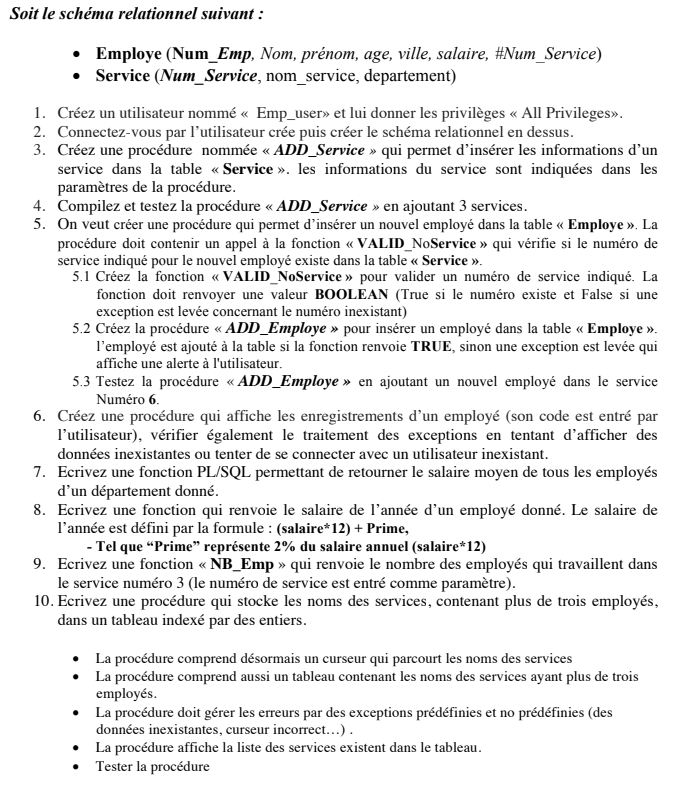

# Exercices_PLSQL_function_procedure

    <h3>The image below contains one of my practice exercises to improve my knowledge of PL/SQL.  
    The solution to this exercise is provided in the attached file. </h3> 

 
 

